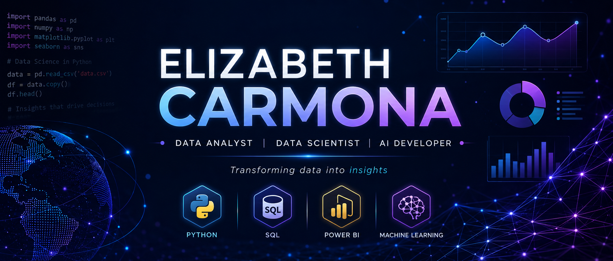
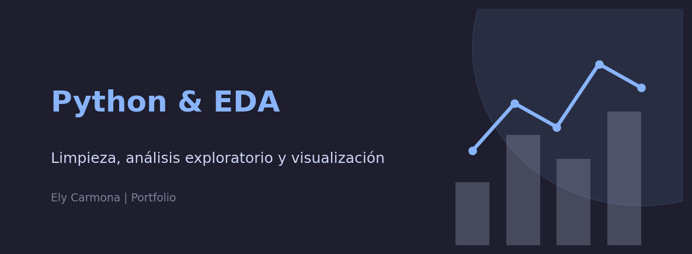
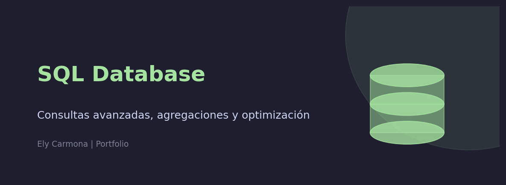
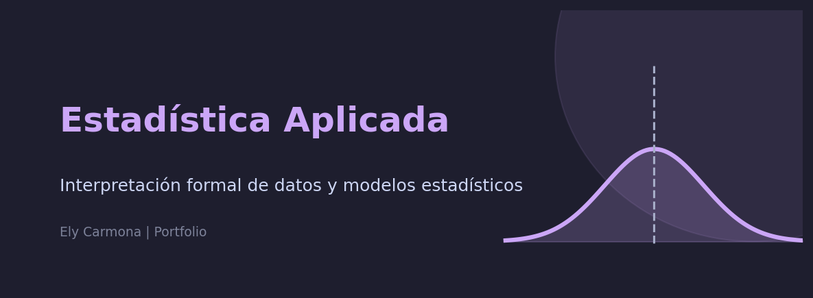
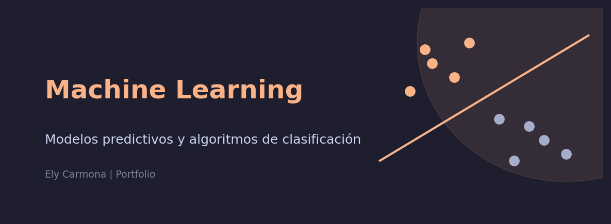
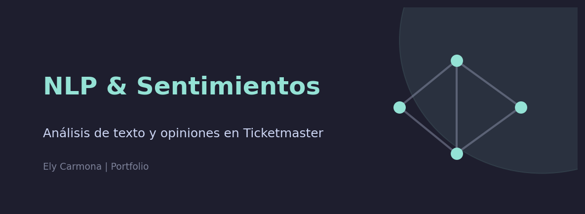
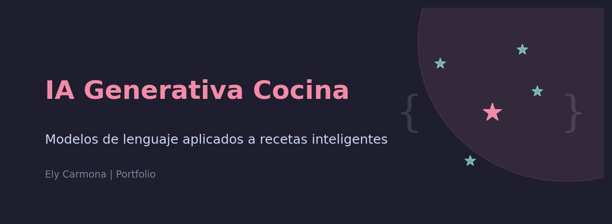

  

## 👩‍💻 Sobre mí

¡Hola! Soy una apasionada del análisis de datos, la visualización y el potencial de la Inteligencia Artificial para resolver problemas reales. 

Actualmente, estoy enfocada en potenciar mis habilidades en **Data Analytics** y **Business Intelligence**, mientras expando mis horizontes hacia la creación y el **despliegue de aplicaciones basadas en IA Generativa y modelos inteligentes** (LLMs, sistemas RAG).

* 📊 **Análisis y Visualización:** Disfruto transformando datos en bruto en narrativas visuales claras, accionables y con valor estratégico.
* 🐍 **Tech Stack:** Trabajo activamente con Python, SQL, librerías de datos (Pandas, NumPy, Matplotlib, Seaborn) y herramientas de BI como Power BI.
* 🚀 **Despliegue e IA:** Me motiva llevar los modelos un paso más allá de los datos locales, explorando la creación de APIs (FastAPI) y el despliegue de soluciones interactivas (Streamlit).

## 💻 Tech Stack

<table align="center">
  <tr>
    <td align="center" width="200">
      <strong>🐍 Lenguajes</strong>
    </td>
    <td>
      
      
    </td>
  </tr>
  <tr>
    <td align="center">
      <strong>🗄️ Bases de Datos</strong>
    </td>
    <td>
      
      
    </td>
  </tr>
  <tr>
    <td align="center">
      <strong>📊 Análisis & Visualización</strong>
    </td>
    <td>
      
      
      
      
      
    </td>
  </tr>
  <tr>
    <td align="center">
      <strong>🤖 Machine & Deep Learning</strong>
    </td>
    <td>
      
      
      
    </td>
  </tr>
  <tr>
    <td align="center">
      <strong>🧠 IA Generativa & NLP</strong>
    </td>
    <td>
      
      
      
      
    </td>
  </tr>
  <tr>
    <td align="center">
      <strong>🚀 Despliegue & APIs</strong>
    </td>
    <td>
      
      
      
    </td>
  </tr>
  <tr>
    <td align="center">
      <strong>🛠️ Herramientas</strong>
    </td>
    <td>
      
      
      
    </td>
  </tr>
</table>

## 📂 Proyectos Destacados

  
🔗 [Ir al proyecto](https://github.com/elycarmonadev/Proyecto-EDA)    
Proyecto de análisis exploratorio de datos utilizando Python y librerías como Pandas, Matplotlib y Seaborn para la limpieza, análisis y visualización de datos.

  
🔗 [Ir al proyecto](https://github.com/elycarmonadev/Proyecto-SQL)   
Consultas y análisis de bases de datos relacionales utilizando SQL, aplicando joins, subqueries, agregaciones y optimización de consultas.

  
🔗 [Ir al proyecto](https://github.com/elycarmonadev/Proyecto-Estadistica)    
Aplicación de conceptos estadísticos para el análisis e interpretación de datos mediante Python.

  
🔗 [Ir al proyecto](https://github.com/elycarmonadev/Proyecto-ML)    
Desarrollo de modelos de Machine Learning para clasificación y predicción utilizando Scikit-Learn.

  
🔗 [Ir al proyecto](https://github.com/elycarmonadev/ticketmaster-nlp-analysis)    
Proyecto de análisis de texto y sentimientos aplicando técnicas de NLP sobre comentarios y opiniones relacionadas con eventos.

  
🔗 [Ir al proyecto](https://github.com/elycarmonadev/proyecto-iagen-cocina)   
Proyecto enfocado en IA Generativa aplicando modelos de lenguaje para la generación de recetas e interacción inteligente.

## 📫 Contáctame

### ¡Conectemos! 🌟

Siempre abierta a nuevos proyectos, colaboraciones en datos e IA, oportunidades laborales o simplemente charlar sobre tecnología.

 

<table>
  <tr>
    <td align="center">
      <a href="https://www.linkedin.com/in/elizabeth-carmona-salbado-71520b194/" target="_blank">
         
        <b>Perfil profesional</b>
      </a>
    </td>
    <td align="center">
      <a href="mailto:elycarmona.dev@gmail.com">
         
        <b>Propuestas y oportunidades</b>
      </a>
    </td>
    <td align="center">
      <a href="https://github.com/elycarmonadev" target="_blank">
         
        <b>Mis proyectos</b>
      </a>
    </td>
  </tr>
</table>

 

📍 Basada en España &nbsp;·&nbsp; 🌐 Disponible para trabajo remoto &nbsp;·&nbsp; 💬 Español

